layout: true
    
<div class="logo"></div> 


```{r setup, include=FALSE, cache=TRUE}
# Here you can place global options for the entire document.
# Mostly used for knitr settings, but can also load data etc.
# Whatever happens here will not show in the presentation.
knitr::opts_chunk$set(fig.retina = 3, 
                      warning = FALSE, 
                      message = FALSE,
                      echo = TRUE)
```

---
class: center, middle

# Why this paper?

### LC integrity and memory performance in young and older adults
### different approaches with similar results(?)


---
class: middle, center


# some background

---
### Memory performance declines with advancing adult age
### Age-associate changes in these areas contribute to memory imparirments

- neocortical regions
- the hippocampus
- dopaminergic neuromodulation

### recent findings from animal and post-mortem human studies:

- cell loss and accumulation of abnormal tau ( $\tau$ ) in the LC
-  studies showing that in encoding negative emotional events LC integrity plays a role
  - not much beyond that
  
### crucially important for age-related memory disorders
---
# What is LC anyway?

#### located in the dorsolateral tegmentum 
#### a hyperpigmented cylindrical cluster of catecholaminergic  neurons --- blue spot 
#### roughly symmetrical in both hemishpheres --- in average 14.5mm long and 2-2.5mm thick
#### the brain's primary source of norepinephrine (NE)  

```{r, echo=FALSE, out.width="40%", fig.align='center'}
 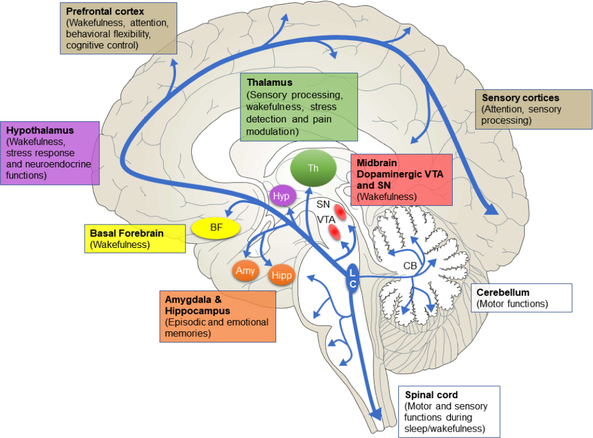
```
---
# Roles of LC

### NE from LC modulates perception, attention, learning, and memory
#### modulation of LTP and LTD — synaptic plasticity and memory formation
#### studies reported the causal role of NE or its agonists in learning and memory

### prone to exposure from CSF and blood-bound toxins — a target for neurodegeneration
---
# in vivo assessments of LC integrity in humans

#### Very difficult — small size and deeply located in the brainstem
### Neuromelanin
- dark and insoluble pigment
- by-prdocut of catecholamine synthesis
- accumulates across the lifespan (~late middle age)
- chelates (attaching a ligand to metals) such as copper and iron
  - results in paramagnetic, T1-shortening effects

--

### Neuromelanin acts as a natural contrast agent for non-invasive, in vivo assessment of LC integrity via MRI
---
class: center, middle

# this study

---
# Rey Auditory Verbal Learning Test (RAVLT)
#### a validated neuropsychological measure of memory functioning 
- the  analysis  of  individual  learning  trajectories
  - the increase in recall performance across iterative item presentations
  - conveys valuable information about a participant’s current and future cognitive status

```{r, echo=FALSE, out.width="90%", fig.align='center'}
 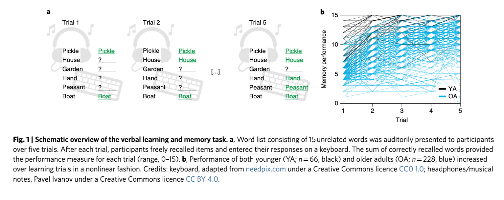
```
---
# Rey Auditory Verbal Learning Test (RAVLT)
```{r, echo=FALSE, out.width="70%", fig.align='center'}
 
```
#### previous studies: aging is linked to lower initial memory performance AND slower learning with practice

### Hypothesis
####the integrity of the LC-NE system as assessed by neuromelanin-sensitive  MRI would be closely associated with individual differences in initial memory performance and learning rates.
---
class: middle, center
#Results 
---
class: center, middle, white

```{r, echo=FALSE, out.width="90%", fig.align='center'}
 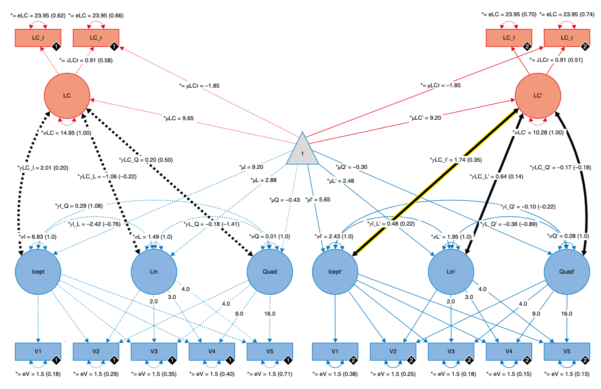
```
pretty self-explanatory 💁
---

```{r, echo=FALSE, out.width="90%", fig.align='center'}
 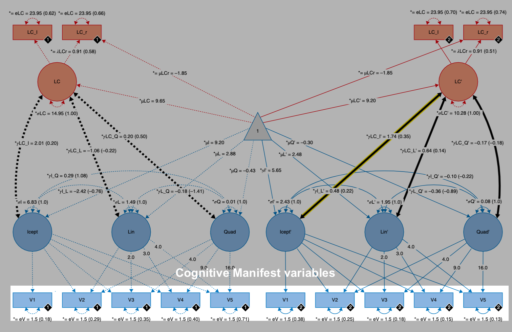
```
---
```{r, echo=FALSE, out.width="90%", fig.align='center'}
 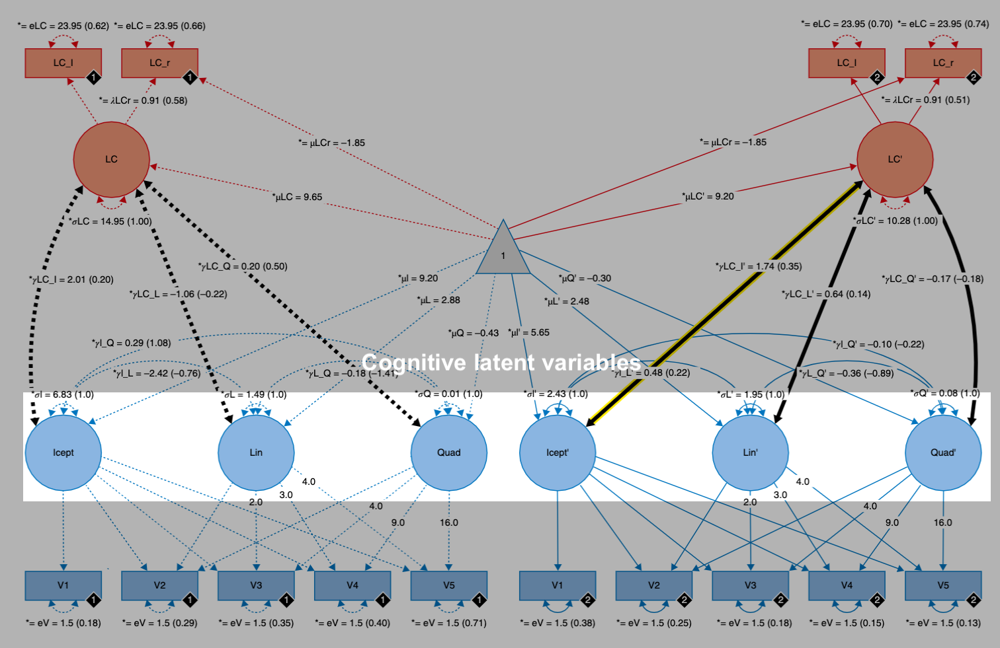
```
---
```{r, echo=FALSE, out.width="90%", fig.align='center'}
 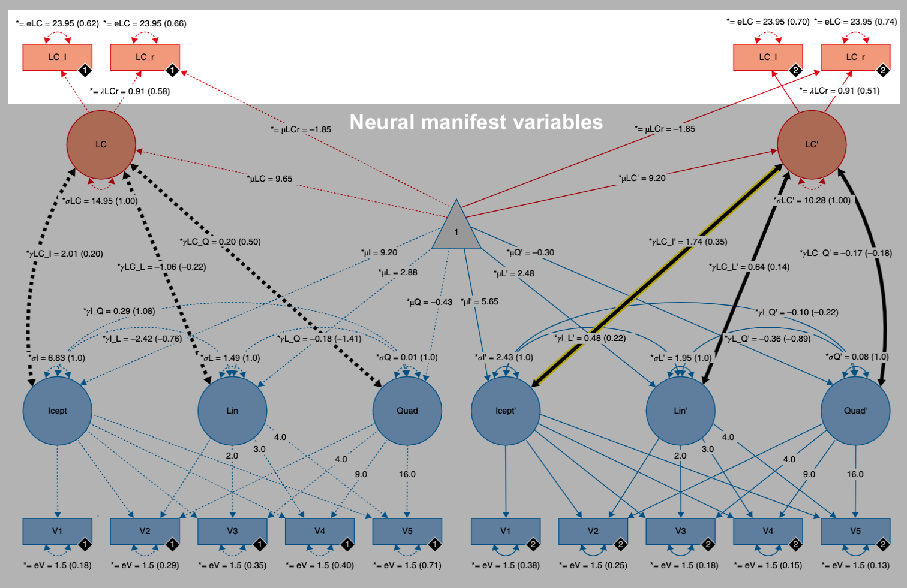
```
---
```{r, echo=FALSE, out.width="90%", fig.align='center'}
 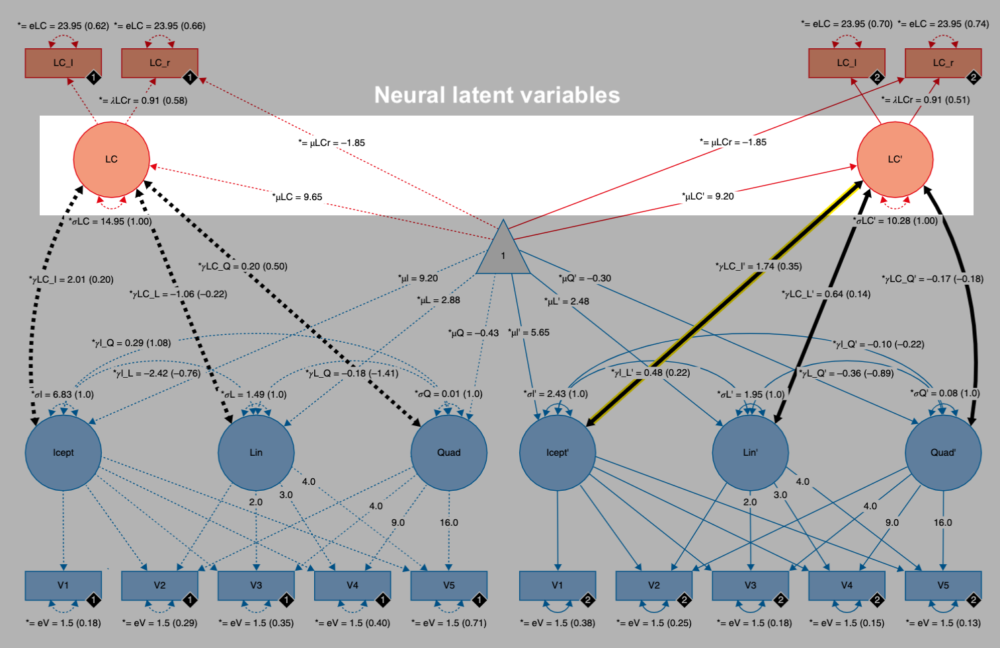
```
---
```{r, echo=FALSE, out.width="90%", fig.align='center'}
 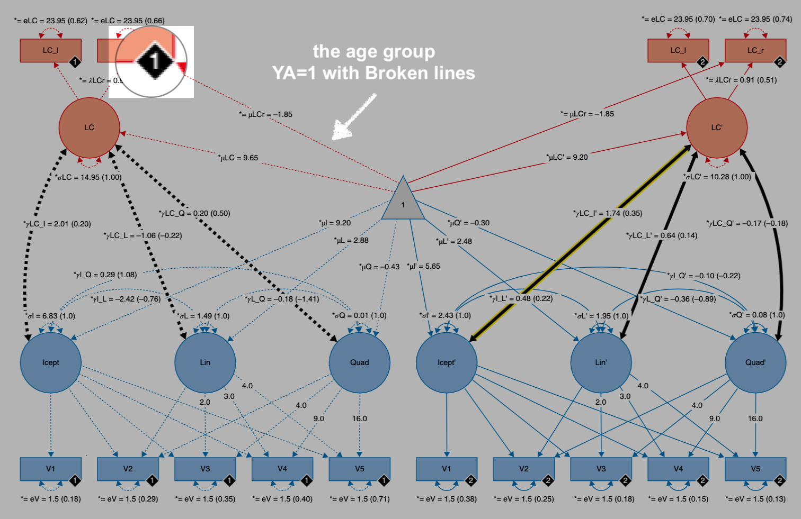
```
---
```{r, echo=FALSE, out.width="90%", fig.align='center'}
 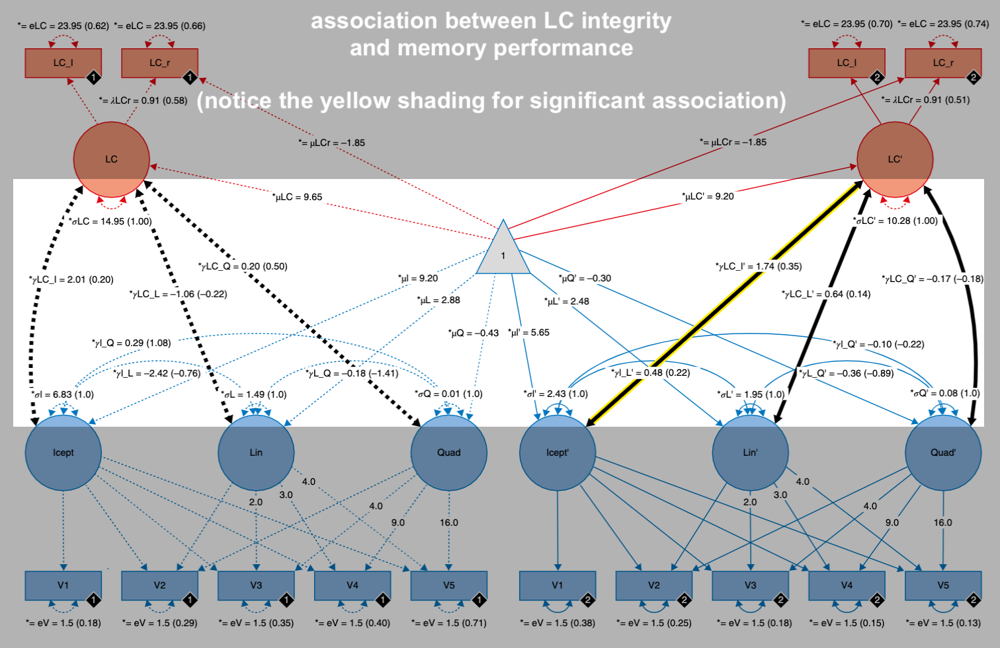
```
---
```{r, echo=FALSE, out.width="90%", fig.align='center'}
 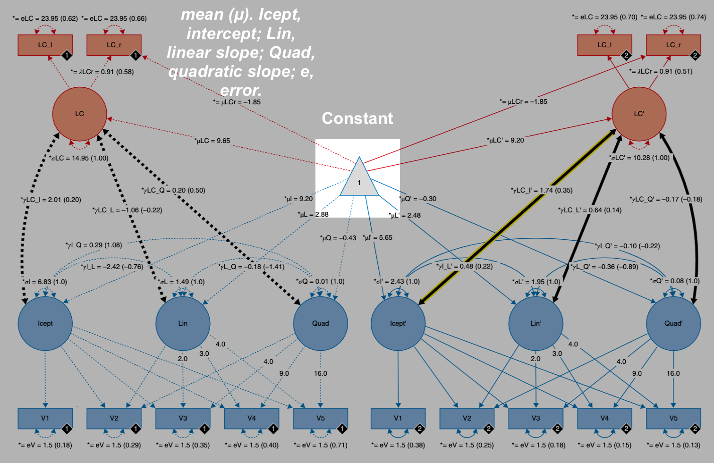
```
---
#results

## Locus coeruleus integrity scores are positively associated with initial recall performance in older adults

## Lower age differences in rostral LC intensity ratios* relate to memory performance in older adults.


\* next slide

---
class: center, middle, white
```{r, echo=FALSE, out.width="78%", fig.align='center'}
 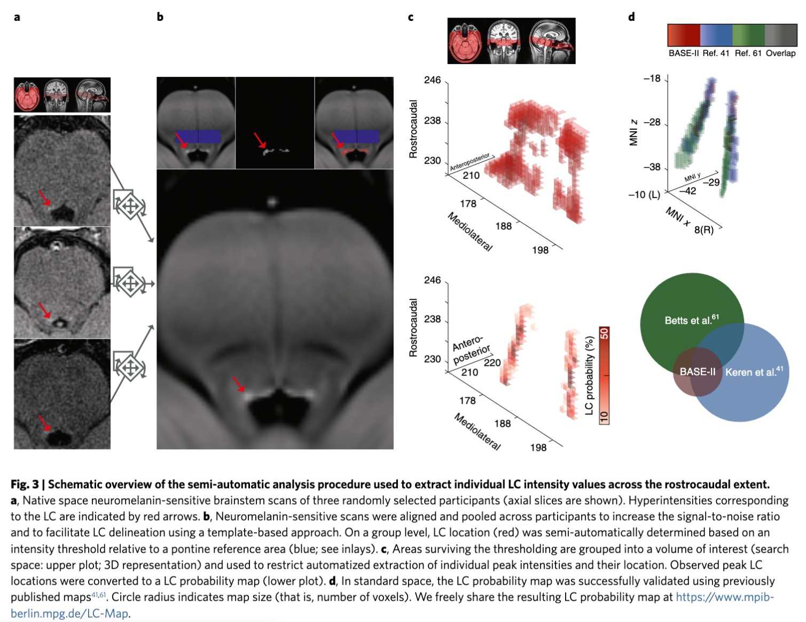
```

---

class: center, middle, white
```{r, echo=FALSE,  out.width="85%", fig.align='center'}
 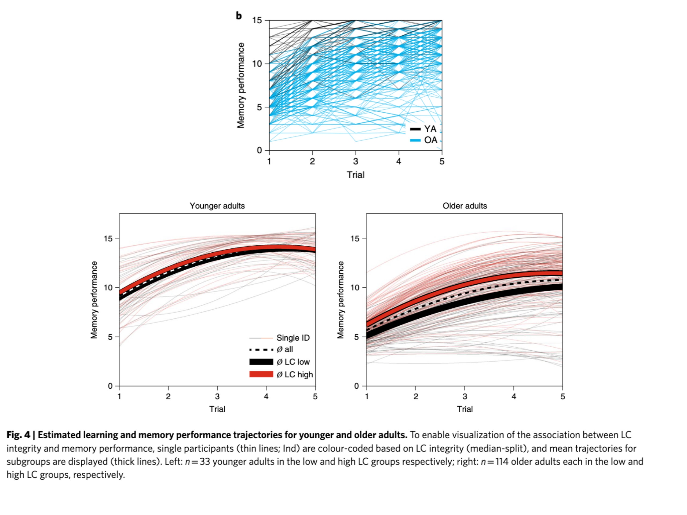

```
---
# 3 mechanisms of noradrenergic action
#### 1. NE release in the sensory cortices increases signal-to-noise ratios by silencing spontaneous activity while sparing or even facilitating  stimulus-evoked responses (in self-enhancing feedback loops with Glu)
 -  NE improves the temporal organization of neuronal responses to sensory stimulation (spike rhythmicity) and thus increases perceptual acuity
 
#### 2. via action on post-synaptic α2A-adrenoceptors  in  the  pre-frontal cortex, moderate levels of NE facilitate delay-related activity, which  is  considered  a  cellular  analogue of  working  memory
 - Hence, LC integrity may promote attentional and control mechanisms implicated in successful episodic memory performance

#### 3. in  the  amygdala  and  hippocampus,  NE  modulates  synaptic  strength and facilitates synaptic plasticity.
 - The LC  modulates  LTP  and  LTD,  major determinants of long-term memory

---
# Summary
#### Using a non-invasive, in vivo marker of LC integrity as indicator of preserved memory performance in human aging

#### There are spatially confined and functionally relevant differences between younger and older adults in those segments of the LC that are connected to key memory structures such as the hippocampus. 

#### SEM revealed reliable and stable positive  associations  between  LC  integrity  and  general  episodic  memory  among  older  adults. 

## Older adults with better preserved LC integrity are equipped with more proficient episodic memory.

---
class: center, middle
color:#003DA5;
background-image: url("ucr-header.png");
background-size: 250px
background-position: 9% 15%

<span style='font-size:55pt; color:#FFB81C'> Thanks! </span>

```{r, echo=FALSE, fig.align='center'}
 knitr::include_graphics("https://c.tenor.com/5-0hHTpMi5MAAAAC/arrested-development-george-michael.gif")
```

<br>

